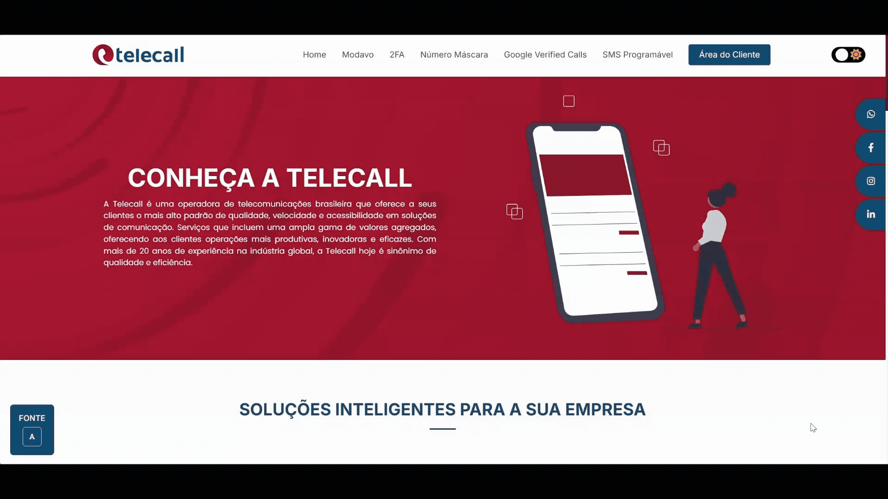
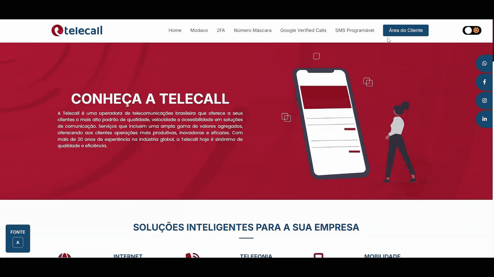
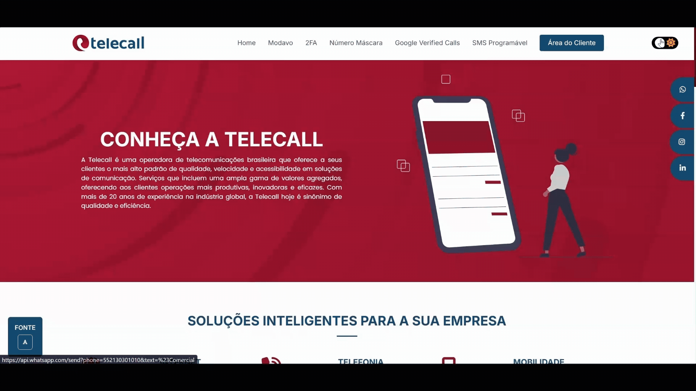

# Projeto Front-End - Telecall

## Sobre o Projeto
Redesign da interface da operadora Telecall, unindo princípios de UX à implementação de componentes responsivos e navegação intuitiva. O projeto prioriza a fidelidade visual e a usabilidade, assegurando a consistência da interface em múltiplos breakpoints e a compatibilidade cross-browser.

O objetivo principal foi modernizar a presença digital da operadora, focando em conversão e facilidade de acesso aos serviços de telecomunicações e CPaaS.

## Funcionalidades Implementadas
- **Landing Page Institucional**: Interface moderna para apresentação de serviços.
- **Fluxos de Autenticação**: Páginas de login e cadastro otimizadas para clientes PF e PJ.
- **Área do Cliente**: Interface dedicada para gestão de serviços e conta.
- **Páginas de Produtos**: Detalhamento de soluções como SMS Programável e Google Verified Calls.
- **Design Responsivo**: Adaptabilidade total para smartphones, tablets e desktops.

## Tech Stack
- **HTML5**: Estruturação semântica e acessível.
- **CSS3**: Estilização avançada e layouts fluidos.
- **JavaScript**: Interatividade e validações dinâmicas.
- **Bootstrap**: Framework para grid responsivo e componentes de UI.
- **AOS (Animate On Scroll)**: Implementação de animações para melhor experiência de navegação.

## Demonstração do Projeto
\
\
\

---
Desenvolvido por [Aurea Yohanna](https://github.com/aureayohanna)
